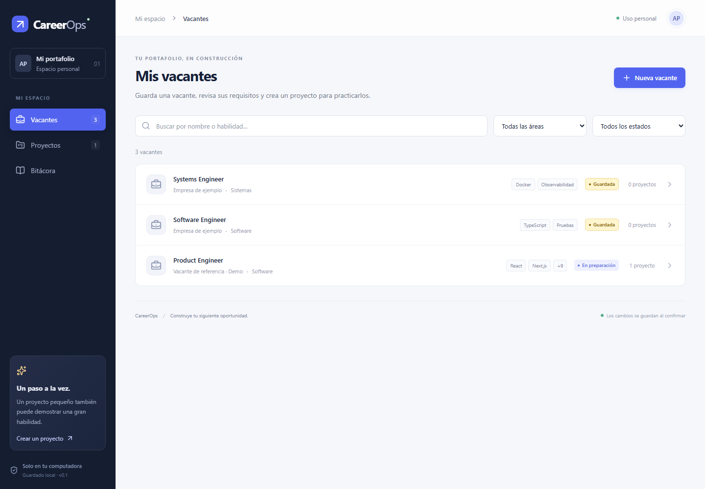
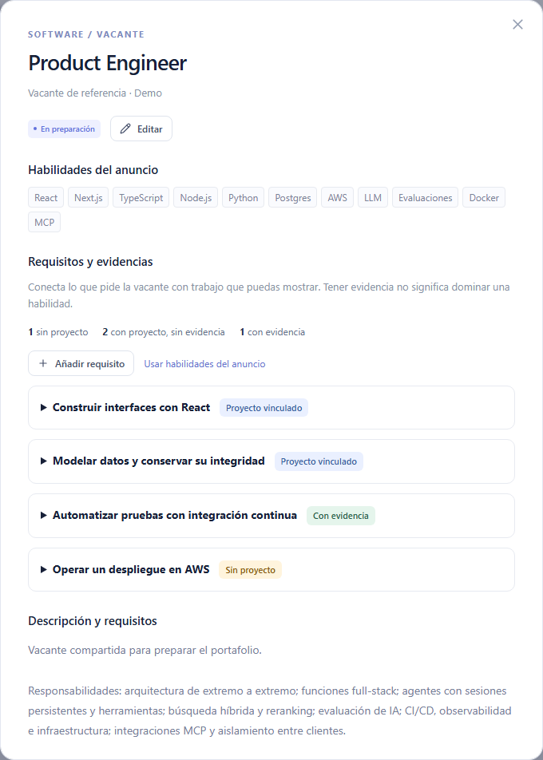
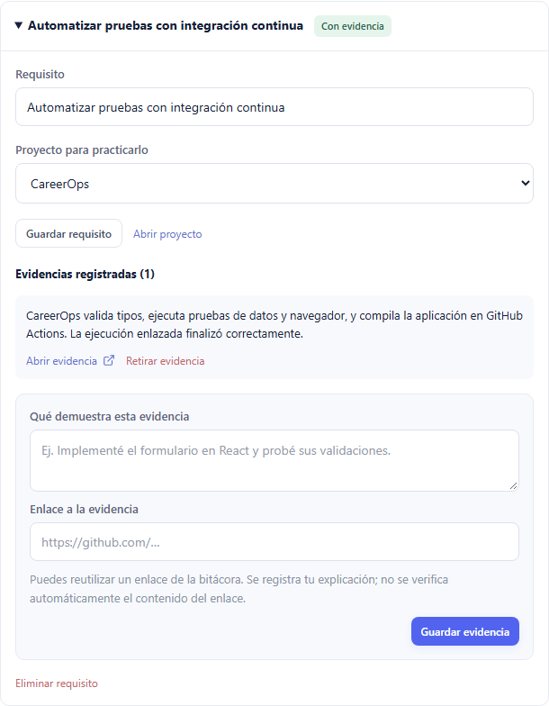
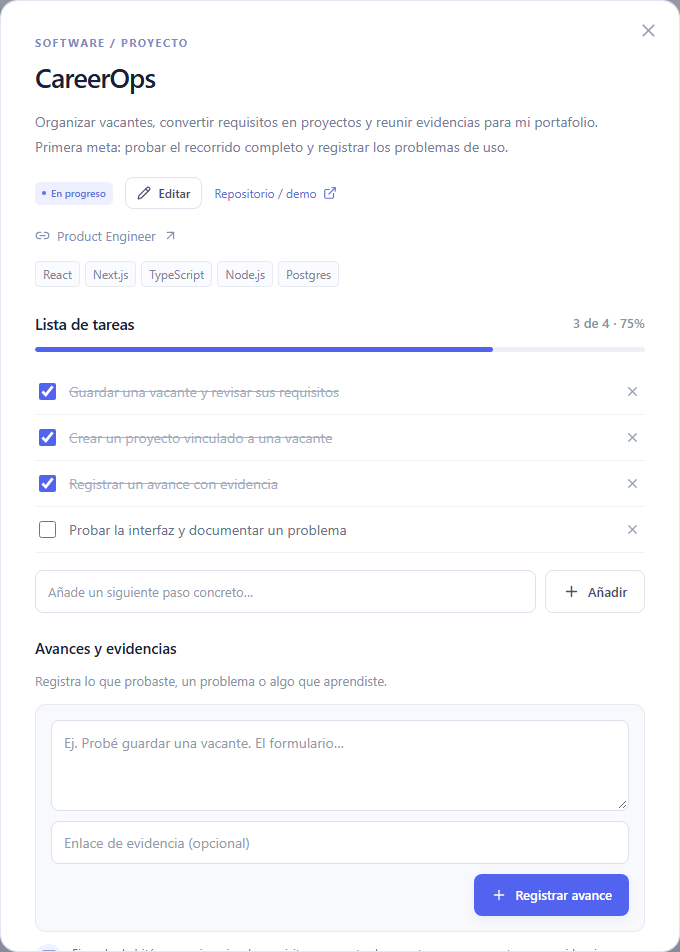
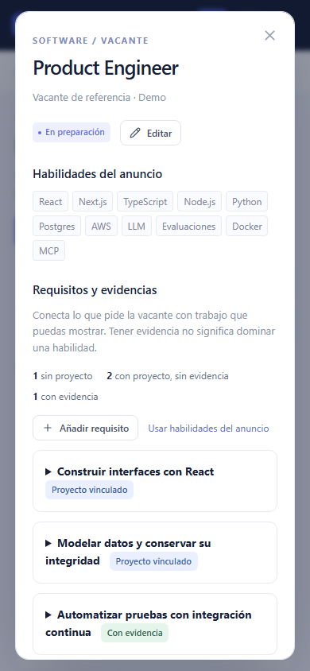
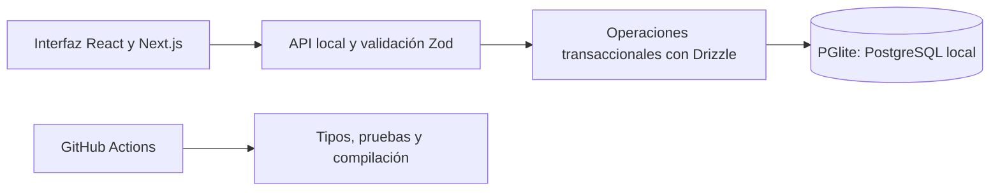

# CareerOps

### De una vacante a un proyecto que puedes mostrar

**Caso de estudio · Proyecto personal · Septiembre de 2026**  
**Mi participación:** definición del producto, decisiones de UX y pruebas manuales.  
**Desarrollo:** implementación asistida por IA, con validación automatizada y revisión de uso.  
**Estado:** prototipo local funcional, para una persona.



_Captura de la aplicación real con datos de demostración. Las empresas de ejemplo no representan clientes ni procesos de selección reales._

## El problema

Una oferta de empleo enumera muchas tecnologías y responsabilidades, pero no explica qué proyecto conviene construir para prepararse. Guardar anuncios, ideas y enlaces en lugares separados hace difícil responder: «¿Qué pide esta vacante y qué trabajo puedo mostrar relacionado con ello?».

Creé CareerOps como proyecto personal para organizar ese recorrido: **vacante → requisito → proyecto → evidencia**. El primer anuncio de referencia fue Product Engineer. El objetivo del prototipo es ayudar a planear y documentar la preparación; no califica automáticamente a una persona para un puesto.

## Mi aportación

- Definí la necesidad, el público inicial y el recorrido del producto.
- Probé formularios, selecciones, estados, creación de registros y navegación.
- Detecté que «Vista general» duplicaba acciones y confundía el punto de entrada. Propuse conservar Vacantes, Proyectos y Bitácora.
- Pedí distinguir visualmente las vacantes guardadas y archivadas con amarillo y naranja, manteniendo sus etiquetas.
- Solicité validación de lenguaje muy ofensivo y comprobé el funcionamiento de la interfaz.
- Investigué un aviso del navegador comparando el modo normal con incógnito y aislando la extensión Urban VPN.
- Revisé el recorrido de requisitos y evidencias y reporté que funcionaba y resultaba claro.

La IA asistió con arquitectura, código, pruebas automatizadas y documentación. Mi experiencia demostrable aquí se centra en criterio de producto y pruebas de uso; el proyecto no supone que haya programado cada componente de forma independiente.

## La solución

### 01 · Convertir requisitos en un plan

Cada vacante permite añadir requisitos o partir de sus habilidades. Se puede asociar un proyecto existente y distinguir tres situaciones: **Sin proyecto**, **Proyecto vinculado** y **Con evidencia**. Un proyecto puede servir para requisitos de varias vacantes.



_Escenario de demostración: hay trabajo vinculado, evidencia registrada y un requisito de AWS todavía sin proyecto. No son indicadores de dominio técnico._

### 02 · Mostrar el trabajo concreto

Cada evidencia exige una explicación y un enlace a código, una prueba, una demo o un documento. Un proyecto completado no produce evidencia automáticamente. El sistema registra lo que se aporta, sin evaluar el contenido remoto.



_El enlace de esta demostración apunta a una ejecución real de las comprobaciones de CareerOps._

### 03 · Seguir tareas y decisiones

Los proyectos reúnen objetivos, tareas y avances. La bitácora conserva notas y eventos para reconstruir decisiones. El porcentaje de un proyecto representa tareas terminadas, no preparación profesional ni dominio de una tecnología.



_Las tareas marcadas en esta captura pertenecen al escenario de demostración._

<details>
<summary>Ver la presentación en una pantalla móvil</summary>



</details>

## Decisiones que cambiaron el producto

| Observación                                                 | Decisión                                             | Resultado comprobado                                                                              |
| ----------------------------------------------------------- | ---------------------------------------------------- | ------------------------------------------------------------------------------------------------- |
| La pantalla inicial repetía acciones de Vacantes.           | Retirar Vista general y abrir directamente Vacantes. | Quedaron tres secciones con propósitos distintos.                                                 |
| Los estados tenían poca diferenciación visual.              | Usar amarillo y naranja, además de texto.            | Guardada y Archivada se distinguen en la interfaz.                                                |
| Vincular un proyecto no demuestra por sí solo un requisito. | Registrar evidencias explícitas por requisito.       | Es posible separar trabajo planeado de enlaces ya aportados.                                      |
| Un aviso aparecía en Chrome, pero no en incógnito.          | Comparar condiciones y aislar extensiones.           | Identifiqué Urban VPN como desencadenante en mi navegador; la carga limpia no reprodujo el error. |

Estas observaciones corresponden a mis pruebas como responsable y usuario del producto. No se ha realizado un estudio con participantes externos ni una medición de mejora en contratación.

## Cómo está construido



**TypeScript · React · Next.js · Node.js · Drizzle · PGlite · Zod · Vitest · Playwright · GitHub Actions**

La API valida los comandos antes de escribir. Las relaciones de datos determinan qué se conserva al eliminar una vacante o un proyecto. Las migraciones registradas permiten actualizar el esquema sin repetir cambios ya aplicados.

PGlite utiliza PostgreSQL en WebAssembly con almacenamiento local. Esta implementación no equivale a operar un servidor PostgreSQL en producción. El repositorio incluye [las decisiones técnicas](../ARQUITECTURA.md) y [las pruebas de requisitos y migración](../../tests/requirements.test.ts).

## Resultados y evidencia

La [ejecución de GitHub Actions 35172189976](https://github.com/axlperalta-dotcom/careerops/actions/runs/35172189976), correspondiente al commit `07b414b`, aprobó:

- **28 pruebas de datos y validación.** Incluyen actualización desde el esquema anterior, integridad de relaciones, persistencia y límites de entrada.
- **6 pruebas de navegador.** Incluyen recorridos completos, recarga, validación, pantalla pequeña y carga sin errores en un navegador limpio.
- **Validación de tipos y compilación.**

Además, probé manualmente el producto y confirmé que el recorrido de requisitos y evidencias funcionaba y no resultaba confuso. Esa es retroalimentación de una sola persona, no una métrica de usabilidad general. El número de pruebas describe verificaciones ejecutadas; no es un porcentaje de cobertura ni una garantía de ausencia de fallos.

## Alcance y siguiente etapa

CareerOps funciona localmente, guarda datos y tiene un recorrido revisado por su usuario. El repositorio sigue privado; los enlaces a código y CI requieren acceso. No hay una demo pública, cuentas múltiples ni despliegue remoto.

La siguiente etapa propuesta es probarlo con otra persona, observar dónde necesita ayuda y registrar los resultados. Antes de un piloto remoto se necesitarían autenticación, autorización, respaldos y un diseño de despliegue. La experiencia con LLM, AWS, MCP y sistemas regulados pertenece a futuros proyectos, no a las capacidades entregadas por este prototipo.

---

[Texto para CV](CV.md) · [Guion de entrevista y demo](ENTREVISTA.md) · [Repositorio](https://github.com/axlperalta-dotcom/careerops) · [Documentación principal](../../README.md)

### Sobre las capturas

Se generaron desde la aplicación, sin retocar su interfaz, con una base de demostración independiente de los registros personales. Para reproducirlas desde la raíz del repositorio:

```sh
npx playwright test --config scripts/portfolio.config.ts
```

El proceso usa el puerto 3012, una carpeta nueva bajo `.data/portfolio-*` y `.next-portfolio`. Guarda las imágenes en `docs/portafolio/images`. No requiere credenciales de GitHub ni cambia la base personal.
